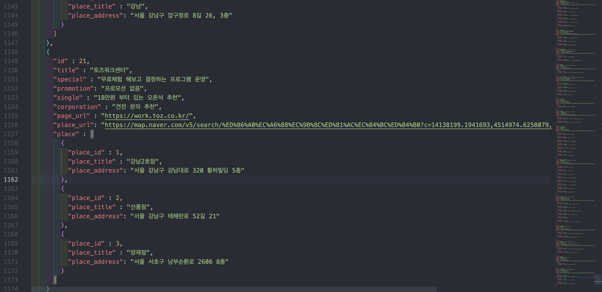

# 05(공오)
## 점점 핫해지는 공유 오피스! 정보가 너무 부족하다 알지 못 했던 공유 오피스들의 정보를 제공하는 서비스

### 기간
- 2022.08.01 ~ 진행 중
### 대상
- 카페나 독서실은 싫은 개인회원
- 스타트업 창업이 목표인 예비 대표님
### 스킬
- React(react-bootstrap, react-router, react-slick)
- Javascript(es6), css(sass), html

 

## 8월 18일 진행 상황
### 메인화면 진행도

- React-bootstrap을 사용하여 메인 중앙부 슬라이드를 구현 하였습니다
- React-Slick라이브러리를 이용하여 캐러셀 슬라이드를 구현 하였습니다
- 공유오피스를 선택해야 하는 이유를 간단하게 텍스트로 구현 하였습니다
- Navbar생성 후 상단 공유오피스리스트에 react-router의 useNavigate를 사용하여 /list로 이동할 수 있게 구현 하였습니다 
- 05로고 클릭시 /home으로 이동할 수 있게 구현 하였습니다

### 리스트 진행도

- Data JSON 생성
- 20개의 공유오피스 데이터 배열을 반복할 수 있는 map()함수 사용 데이터 바인딩
- 데이터 바인딩을 통한 UI구현 완료

- axios를 통해 비동기처리 후 배열의 반복을 통해 바인딩한 코드

### 8월 18일 공유오피스 상세보기 페이지 목업 진행 중
